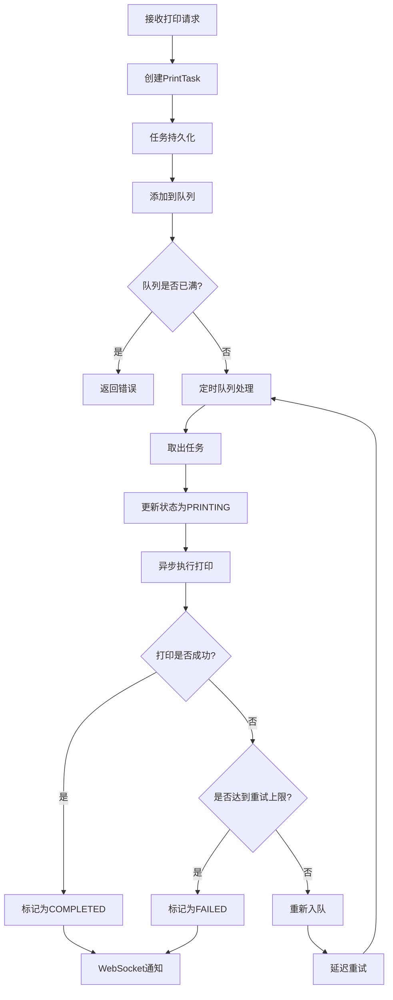
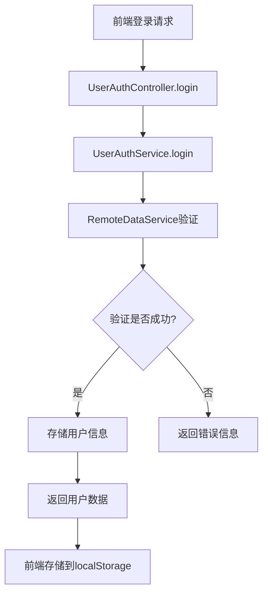

# 后端技术文档

> 📖 **后端专项文档** | [← 返回主文档 README.md](../README.md) | [← 返回文档索引](./文档索引.md)

本文档深入分析Electron打印应用的后端技术实现，包含Spring Boot应用架构、打印服务设计、队列管理、WebSocket通信等核心内容。

---

## 📋 后端技术栈

### 技术选型总览
- **框架版本**: Spring Boot 2.6.13
- **Java版本**: JDK 8
- **构建工具**: Maven 3.8.1
- **打包方式**: 可执行JAR + Launch4j EXE
- **数据存储**: 文件系统持久化
- **通信协议**: RESTful API + WebSocket/STOMP

### 后端特色
- ✅ **企业级架构** - 标准的Spring Boot分层架构
- ✅ **异步处理** - 基于队列的异步打印任务处理
- ✅ **实时通信** - WebSocket + STOMP协议双向通信
- ✅ **高可靠性** - 任务持久化、重试机制、故障恢复
- ✅ **多打印机支持** - 灵活的打印机选择和管理

## 🏗️ 后端架构设计

### 分层架构
```
┌─────────────────────────────────────────────────────────────┐
│                    Spring Boot 后端服务                     │
├─────────────────────────────────────────────────────────────┤
│  🌐 控制器层 (Controllers) - API入口                        │
│  ├── PrintApiController (RESTful API)                      │
│  ├── UserAuthController (用户认证)                         │
│  └── PrintMessageController (WebSocket消息)                │
├─────────────────────────────────────────────────────────────┤
│  🔧 服务层 (Services) - 业务逻辑                            │
│  ├── UnifiedPrintService (统一打印服务)                     │
│  ├── UserAuthService (用户认证服务)                         │
│  ├── RemoteDataService (远程数据服务)                       │
│  └── PrintTaskNotificationService (任务通知服务)           │
├─────────────────────────────────────────────────────────────┤
│  🔩 组件层 (Components) - 功能组件                          │
│  ├── PrintQueueManager (队列管理器)                         │
│  ├── PrintTaskPersistence (任务持久化)                      │
│  ├── PrintWebSocketHandler (WebSocket处理)                 │
│  └── PrintMetrics (性能监控)                               │
├─────────────────────────────────────────────────────────────┤
│  ⚙️ 配置层 (Configurations) - 系统配置                     │
│  ├── StompWebSocketConfig (STOMP配置)                      │
│  ├── ThreadPoolConfig (线程池配置)                          │
│  └── SchedulerConfig (调度器配置)                           │
└─────────────────────────────────────────────────────────────┘
```

### 目录结构概览
```
backend/src/main/java/org/example/print/
├── 📄 PrintApplication.java      # Spring Boot启动类
├── 📁 controller/                # 控制器层 - API入口
├── 📁 service/                   # 服务层 - 业务逻辑  
├── 📁 component/                 # 组件层 - 功能组件
├── 📁 config/                    # 配置层 - 系统配置
├── 📁 bean/                      # 数据层 - 实体对象
└── 📁 event/                     # 事件层 - 事件处理
```

## 🎯 核心功能模块

### 1. RESTful API服务
**文件**: `controller/PrintApiController.java` (195行)

**主要接口**:
```java
@RestController
@RequestMapping("/api")
public class PrintApiController {
    
    // 获取待处理任务
    @GetMapping("/tasks/pending")
    public ResponseEntity<List<PrintTask>> getPendingTasks()
    
    // 添加打印任务
    @PostMapping("/tasks")
    public ResponseEntity<PrintTask> addPrintTask(@RequestBody PrintTask task)
    
    // 获取打印机列表
    @GetMapping("/printers")
    public ResponseEntity<List<Map<String, String>>> getPrinters()
    
    // 获取系统状态
    @GetMapping("/system/status")
    public ResponseEntity<Map<String, Object>> getSystemStatus()
    
    // 测试打印
    @PostMapping("/print/test")
    public ResponseEntity<?> testPrint(@RequestBody Map<String, String> params)
}
```

**功能特性**:
- ✅ **完整的CRUD操作** - 任务的创建、查询、删除
- ✅ **系统状态监控** - 队列大小、成功率、打印机状态
- ✅ **打印机管理** - 获取可用打印机、设置默认打印机
- ✅ **测试功能** - 提供打印测试接口

### 2. 用户认证系统
**文件**: `controller/UserAuthController.java` (93行)

**认证流程**:
```java
@RestController
@RequestMapping("/api/user")
public class UserAuthController {
    
    // 用户登录
    @PostMapping("/login")
    public ResponseEntity<Map<String, Object>> login(@RequestBody Map<String, String> loginRequest)
    
    // 用户登出
    @PostMapping("/logout")
    public ResponseEntity<Map<String, Object>> logout()
    
    // 获取用户状态
    @GetMapping("/status")
    public ResponseEntity<Map<String, Object>> getStatus()
}
```

**认证特性**:
- ✅ **简化认证流程** - 适配本地桌面应用场景
- ✅ **状态维护** - 用户ID、商户ID、店铺ID管理
- ✅ **会话管理** - 登录状态持久化

### 3. 统一打印服务
**文件**: `service/UnifiedPrintService.java` (546行)

**核心功能**:
```java
@Service
public class UnifiedPrintService {
    
    // 获取所有打印机
    public List<PrintService> getAllPrinters()
    
    // 根据名称获取打印机
    public PrintService getPrinterByName(String printerName)
    
    // 执行打印任务
    public CompletableFuture<PrintResult> executePrint(PrintTask task)
    
    // 检查打印机状态
    public boolean isPrinterReady(String printerName)
    
    // 格式化打印内容
    private String formatPrintContent(JSONObject data)
}
```

**技术特色**:
- ✅ **智能打印机选择** - 支持指定打印机、默认打印机、第一台可用打印机
- ✅ **多格式支持** - JSON数据格式化、纯文本打印、图片打印
- ✅ **异步执行** - CompletableFuture异步打印处理
- ✅ **测试模式** - 支持文件输出模式进行开发测试

### 4. 打印队列管理
**文件**: `component/PrintQueueManager.java` (206行)

**队列架构**:
```java
@Component
public class PrintQueueManager {
    
    // 添加打印任务
    public void addPrintTask(PrintTask task)
    
    // 定时处理打印任务
    @Scheduled(fixedRate = 1000)
    public void processPrintTasks()
    
    // 处理失败任务
    private void handleFailedTask(PrintTask task)
    
    // 获取队列大小
    public int getQueueSize()
}
```

**队列特性**:
- ✅ **高并发支持** - 基于BlockingQueue的线程安全队列
- ✅ **智能重试** - 指数退避算法 + 随机抖动
- ✅ **持久化恢复** - 系统重启后自动加载未完成任务
- ✅ **流量控制** - 队列大小限制和超时机制

### 5. WebSocket实时通信
**文件**: `config/StompWebSocketConfig.java` (44行)

**STOMP配置**:
```java
@Configuration
@EnableWebSocketMessageBroker
public class StompWebSocketConfig implements WebSocketMessageBrokerConfigurer {
    
    @Override
    public void configureMessageBroker(MessageBrokerRegistry config) {
        config.enableSimpleBroker("/topic");
        config.setApplicationDestinationPrefixes("/app");
    }
    
    @Override
    public void registerStompEndpoints(StompEndpointRegistry registry) {
        registry.addEndpoint("/print-ws")
                .setAllowedOriginPatterns("*")
                .withSockJS()
                .setHeartbeatTime(25000);
    }
}
```

**通信特性**:
- ✅ **双协议支持** - 原生WebSocket + STOMP协议
- ✅ **SockJS降级** - 网络环境兼容性保障
- ✅ **心跳机制** - 25秒心跳检测保持连接活跃
- ✅ **广播推送** - 任务状态变更实时推送

## 🗃️ 数据模型设计

### 核心实体对象
**PrintTask** - 打印任务实体:
```java
@Data
@Builder
public class PrintTask {
    private String taskId;                 // 任务ID
    private String content;                // 打印内容
    private PrintTaskStatus status;        // 任务状态
    private int retryCount;                // 重试次数
    private LocalDateTime createTime;      // 创建时间
    private String printerName;            // 打印机名称
    private PrintTaskPriority priority;    // 任务优先级
}
```

**任务状态枚举**:
```java
public enum PrintTaskStatus {
    PENDING,    // 待处理
    PRINTING,   // 打印中
    COMPLETED,  // 已完成
    FAILED      // 失败
}
```

**任务优先级**:
```java
public enum PrintTaskPriority {
    LOW,        // 低优先级
    NORMAL,     // 普通优先级
    HIGH        // 高优先级
}
```

## ⚙️ 配置管理

### 应用配置 (application.yml)
**打印服务配置**:
```yaml
print:
  printer-name: "GP-C58 Series"      # 默认打印机
  max-retry: 3                       # 最大重试次数
  queue:
    offer-timeout: 5                 # 队列等待超时(秒)
  qrcode-path: classpath:static/qrcode.jpg  # 二维码路径
```

**远程服务配置**:
```yaml
remote:
  server:
    url: http://119.91.239.47        # 远程服务器URL
    ws-path: /print-ws               # WebSocket路径
  auth:
    enabled: false                   # 是否启用认证
  connection:
    retry-interval: 500              # 连接重试间隔(毫秒)
  poll:
    interval: 10000                  # 轮询间隔(毫秒)
```

**服务器配置**:
```yaml
server:
  port: 23333                        # 服务端口

logging:
  file:
    name: ${user.home}/AppData/Roaming/electron-print-app/logs/spring.log
  level:
    org.example.print: INFO
```

### Maven依赖分析
**核心依赖**:
```xml
<!-- Spring Boot 基础 -->
<dependency>
    <groupId>org.springframework.boot</groupId>
    <artifactId>spring-boot-starter-web</artifactId>
</dependency>

<!-- WebSocket 支持 -->
<dependency>
    <groupId>org.springframework.boot</groupId>
    <artifactId>spring-boot-starter-websocket</artifactId>
</dependency>

<!-- PDF处理 -->
<dependency>
    <groupId>org.apache.pdfbox</groupId>
    <artifactId>pdfbox</artifactId>
    <version>2.0.27</version>
</dependency>

<!-- JSON处理 -->
<dependency>
    <groupId>com.alibaba</groupId>
    <artifactId>fastjson</artifactId>
    <version>2.0.52</version>
</dependency>
```

**特殊插件**:
```xml
<!-- Launch4j - 生成Windows可执行文件 -->
<plugin>
    <groupId>com.akathist.maven.plugins.launch4j</groupId>
    <artifactId>launch4j-maven-plugin</artifactId>
    <version>2.1.2</version>
</plugin>
```

## 🔄 业务流程设计

### 打印任务处理流程


### 用户认证流程


### WebSocket通信流程
```mermaid
graph TD
    A[客户端连接] --> B[/print-ws端点]
    B --> C[建立WebSocket连接]
    C --> D[订阅/topic频道]
    D --> E[任务状态变更]
    E --> F[notificationService.notifyClient]
    F --> G[通过/topic广播]
    G --> H[客户端接收更新]
```

## 🔧 线程池与调度配置

### 线程池配置
**文件**: `config/ThreadPoolConfig.java` (31行)
```java
@Configuration
@EnableAsync
public class ThreadPoolConfig {
    
    @Bean("printTaskExecutor")
    public Executor printTaskExecutor() {
        ThreadPoolTaskExecutor executor = new ThreadPoolTaskExecutor();
        executor.setCorePoolSize(2);        // 核心线程数
        executor.setMaxPoolSize(5);         // 最大线程数
        executor.setQueueCapacity(100);     // 队列容量
        executor.setThreadNamePrefix("PrintTask-");
        return executor;
    }
}
```

### 调度器配置
**文件**: `config/SchedulerConfig.java` (30行)
- 支持`@Scheduled`注解
- 定时任务队列处理(每秒执行一次)
- 自动任务恢复机制

## 📊 监控与指标

### 性能指标收集
**文件**: `component/PrintMetrics.java` (31行)
```java
@Component
public class PrintMetrics {
    private final AtomicInteger successCount = new AtomicInteger(0);
    private final AtomicInteger totalCount = new AtomicInteger(0);
    
    public void recordSuccess() {
        successCount.incrementAndGet();
        totalCount.incrementAndGet();
    }
    
    public double getSuccessRate() {
        int total = totalCount.get();
        return total == 0 ? 0.0 : (double) successCount.get() / total * 100;
    }
}
```

### 系统状态监控
- **队列大小监控** - 实时队列任务数量
- **成功率统计** - 打印任务成功率计算
- **打印机状态** - 打印机就绪状态检测
- **日志记录** - 详细的操作日志和错误追踪

## 🚀 构建与部署

### Maven构建流程
```bash
# 清理并编译
mvn clean compile

# 运行测试
mvn test

# 打包JAR
mvn package

# 生成可执行文件
mvn package -P launch4j
```

### 构建产物
1. **JAR文件**: `target/boot_print-0.0.1-SNAPSHOT.jar`
2. **EXE文件**: `target/boot_print.exe` (Launch4j生成)
3. **依赖库**: Maven自动管理依赖

### 部署特性
- ✅ **内嵌Tomcat** - 无需外部应用服务器
- ✅ **自包含JAR** - 包含所有依赖
- ✅ **Windows可执行文件** - Launch4j生成EXE
- ✅ **配置外部化** - 支持外部配置文件覆盖

## 📈 性能优化策略

### 异步处理优化
- **异步打印执行** - CompletableFuture异步处理
- **线程池管理** - 专用打印任务线程池
- **队列缓冲** - BlockingQueue缓解并发压力

### 内存管理优化
- **对象池化** - 复用PrintTask对象
- **及时释放** - 完成任务后及时清理
- **内存监控** - JVM参数调优

### 网络通信优化
- **连接复用** - WebSocket长连接
- **心跳机制** - 保持连接活跃
- **重连策略** - 自动断线重连

## 🔐 安全与可靠性

### 数据安全
- **输入验证** - 严格的参数校验
- **SQL注入防护** - 虽然不使用数据库，但做好JSON注入防护
- **跨域配置** - 合理的CORS设置

### 系统可靠性
- **异常处理** - 完善的异常捕获和处理
- **重试机制** - 指数退避重试算法
- **持久化恢复** - 系统重启后任务恢复
- **日志记录** - 详细的操作审计日志

## 🧪 测试与调试

### 测试模式
```yaml
print:
  test-mode: true  # 启用测试模式，打印内容保存到文件
```

### 日志配置
```yaml
logging:
  level:
    org.example.print: DEBUG
    org.example.print.service.RemoteDataService: DEBUG
```

### 调试技巧
- **日志分析** - 使用logback滚动日志
- **队列监控** - 实时监控队列状态
- **性能分析** - JVM性能监控工具

## 📝 扩展建议

### 短期优化
1. **数据库集成** - 替换文件存储为关系型数据库
2. **缓存机制** - 引入Redis缓存热点数据
3. **监控告警** - 集成Spring Boot Actuator
4. **API文档** - 使用Swagger生成API文档

### 长期规划
1. **微服务化** - 拆分为独立的打印服务
2. **云原生支持** - Docker容器化部署
3. **集群支持** - 多实例负载均衡
4. **消息队列** - 使用RabbitMQ或Kafka

---

## 📝 维护记录

- **文档创建时间**: 2024年12月
- **后端版本**: Spring Boot 2.6.13
- **文档状态**: ✅ 完整技术分析完成
- **最后更新**: 详细后端架构分析

---
*本文档基于后端源代码深度分析生成，为后端开发和维护提供全面指南。* 