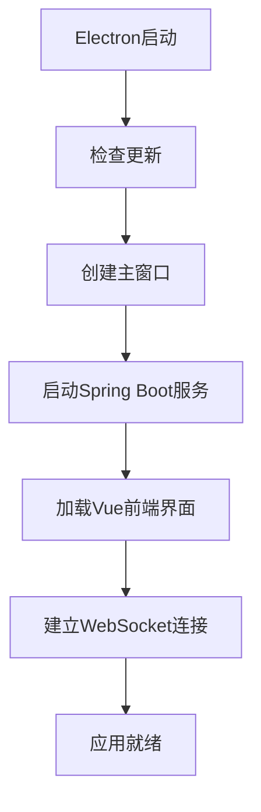
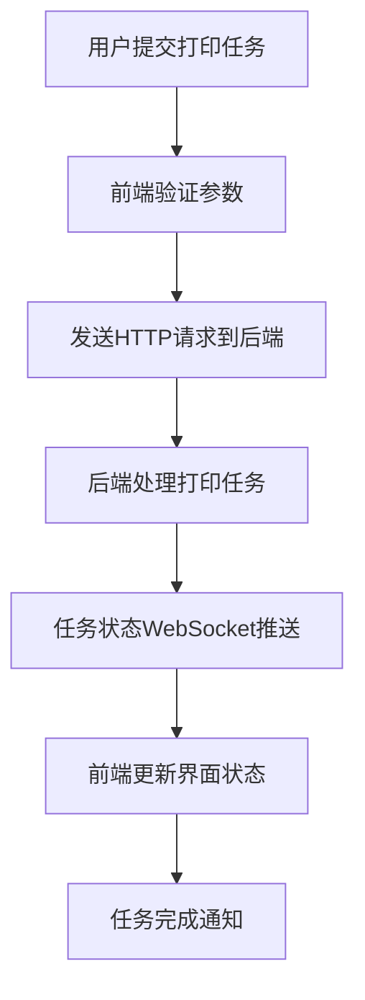
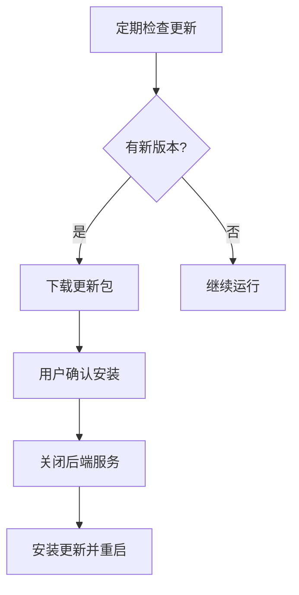

# 项目详细分析文档

> 📖 **技术架构文档** | [← 返回主文档 README.md](./README.md)

本文档提供Electron打印应用的深度技术分析，重点阐述架构设计原理、技术选型依据、开发流程规范和部署策略。

---

## 🏗️ 核心架构设计

### 整体架构原理
本项目采用**前后端分离 + 桌面应用**的三层架构模式：

```
┌─────────────────┐    ┌─────────────────┐    ┌─────────────────┐
│   Electron      │    │   Vue.js        │    │  Spring Boot    │
│   主进程        │◄──►│   前端界面      │◄──►│   后端服务      │
│   (桌面容器)    │    │   (用户交互)    │    │   (业务逻辑)    │
└─────────────────┘    └─────────────────┘    └─────────────────┘
```

### 架构优势分析
- **模块化设计**: 前后端完全分离，便于维护和扩展
- **进程隔离**: Electron多进程架构保证应用稳定性
- **服务内嵌**: Spring Boot服务内嵌，减少部署复杂度
- **通信高效**: IPC + HTTP + WebSocket多层通信机制

### 通信机制设计
- **IPC通信**: Electron主进程与渲染进程间通信
- **HTTP API**: 前端与后端的RESTful接口通信
- **WebSocket**: 实时状态推送和任务更新

## 💻 技术栈选型分析

### 前端技术栈选型
| 技术 | 版本 | 选型理由 | 替代方案 |
|------|------|----------|----------|
| Vue.js | 3.5.13 | 渐进式框架，学习成本低 | React, Angular |
| Element Plus | 2.9.7 | 成熟的企业级UI组件库 | Ant Design Vue |
| Pinia | 3.0.1 | Vue 3官方推荐状态管理 | Vuex |
| Vite | 6.2.0 | 快速构建工具，开发体验好 | Webpack |
| ECharts | 5.6.0 | 功能强大的图表库 | Chart.js |

### 后端技术栈选型
| 技术 | 版本 | 选型理由 | 替代方案 |
|------|------|----------|----------|
| Spring Boot | 2.6.13 | 成熟的企业级框架 | Spring MVC |
| Apache PDFBox | 2.0.27 | 专业的PDF处理库 | iText |
| FastJSON | 2.0.52 | 高性能JSON处理 | Jackson |
| Java | 1.8 | 稳定版本，兼容性好 | Java 11+ |

### 桌面应用技术选型
| 技术 | 版本 | 选型理由 | 替代方案 |
|------|------|----------|----------|
| Electron | 19.0.0 | 跨平台桌面应用框架 | Tauri, Flutter |
| Electron Builder | 24.13.3 | 成熟的打包工具 | electron-packager |

## 🎯 主要功能特性

本项目的功能设计遵循企业级应用的高可用、高性能原则，详细功能实现请参考相应的技术文档：

- **打印服务核心** - 详见[后端技术文档](./docs/后端技术文档.md)
- **桌面应用特性** - 详见Electron技术文档
- **实时通信功能** - WebSocket + STOMP协议实现
- **用户界面特性** - 详见[前端技术文档](./docs/前端技术文档.md)

## 📁 详细目录结构分析

### 前端架构分析
```
frontend/print-client/
├── 📁 src/
│   ├── 📄 App.vue            # 根组件 - 路由出口和全局布局
│   ├── 📄 main.js            # 应用入口 - 插件注册和应用启动
│   ├── 📁 components/        # 可复用组件层
│   │   ├── UpdateComponent.vue # 自动更新UI组件
│   │   └── HelloWorld.vue      # 示例组件（可移除）
│   ├── 📁 views/             # 页面视图层
│   │   ├── Dashboard.vue     # 控制面板 - 核心功能界面
│   │   ├── Settings.vue      # 系统设置 - 配置管理
│   │   ├── History.vue       # 打印历史 - 数据展示
│   │   └── Login.vue         # 登录页面 - 用户认证
│   ├── 📁 store/             # 状态管理层
│   │   ├── tasks.js          # 任务状态管理
│   │   └── printer.js        # 打印机状态管理
│   ├── 📁 services/          # 服务抽象层
│   │   ├── api.js            # HTTP API封装
│   │   └── socket.js         # WebSocket通信
│   └── 📁 router/            # 路由配置层
│       └── index.js          # 路由定义和守卫
```

### 后端架构分析
```
backend/src/main/java/org/example/print/
├── 📄 PrintApplication.java      # Spring Boot启动类
├── 📁 controller/                # 控制器层 - API入口
│   ├── PrintApiController.java   # 主API控制器
│   ├── UserAuthController.java   # 用户认证控制器  
│   └── PrintMessageController.java # WebSocket消息控制器
├── 📁 service/                   # 服务层 - 业务逻辑
│   ├── UnifiedPrintService.java  # 统一打印服务
│   ├── UserAuthService.java      # 用户认证服务
│   ├── RemoteDataService.java    # 远程数据服务
│   └── PrintTaskNotificationService.java # 任务通知服务
├── 📁 component/                 # 组件层 - 功能组件
│   ├── PrintQueueManager.java    # 队列管理器
│   ├── PrintTaskPersistence.java # 任务持久化
│   ├── PrintWebSocketHandler.java # WebSocket处理器
│   └── PrintMetrics.java         # 性能指标
├── 📁 config/                    # 配置层 - 系统配置
│   ├── StompWebSocketConfig.java # STOMP WebSocket配置
│   ├── ThreadPoolConfig.java     # 线程池配置
│   └── SchedulerConfig.java      # 调度器配置
├── 📁 bean/                      # 数据层 - 实体对象
│   ├── PrintTask.java            # 打印任务实体
│   ├── PrintTaskStatus.java      # 任务状态枚举
│   └── PrintTaskPriority.java    # 任务优先级枚举
└── 📁 event/                     # 事件层 - 事件处理
    └── PrintEvents.java          # 打印事件定义
```

## 🔧 核心工作流程

### 1. 应用启动流程


### 2. 打印任务处理流程


### 3. 自动更新流程


## 🚀 开发与部署流程

### 开发环境架构
```
┌─────────────────┐    ┌─────────────────┐    ┌─────────────────┐
│   Electron      │    │   Vite Dev      │    │  Spring Boot    │
│   开发模式      │◄──►│   Server        │◄──►│   开发服务      │
│   localhost     │    │   :5173         │    │   动态端口      │
└─────────────────┘    └─────────────────┘    └─────────────────┘
```

### 生产环境架构
```
┌─────────────────────────────────────────────────────────────────┐
│                    Electron Desktop App                         │
│  ┌─────────────────┐    ┌─────────────────┐    ┌─────────────┐  │
│  │   Main Process  │    │   Vue Static    │    │ Spring Boot │  │
│  │   主进程管理    │◄──►│   Files         │◄──►│ Embedded    │  │
│  │                 │    │   静态文件      │    │ JAR Service │  │
│  └─────────────────┘    └─────────────────┘    └─────────────┘  │
└─────────────────────────────────────────────────────────────────┘
```

### 构建部署命令
```bash
# 开发环境启动
npm install                    # 安装依赖
npm run build:backend         # 构建后端服务
npm run start:frontend        # 启动前端开发服务器
npm run start:electron        # 启动Electron开发模式
npm run dev                   # 同时启动前端和Electron（推荐）

# 生产环境打包
npm run build                 # 构建所有组件
npm run package:win           # 打包Windows应用
npm run package:win-all       # 打包所有架构版本
npm run release-all           # 完整发布流程
```

## 📊 技术亮点与优势

### 1. 架构设计优势
- **模块化设计**: 前后端完全分离，便于维护和扩展
- **进程隔离**: Electron多进程架构保证应用稳定性
- **服务内嵌**: Spring Boot服务内嵌，减少部署复杂度

### 2. 用户体验优势
- **原生体验**: 桌面应用形态，操作流畅自然
- **离线运行**: 本地服务，无需依赖网络
- **自动更新**: 无感知更新，保持功能最新

### 3. 部署运维优势
- **一键安装**: NSIS安装包，用户安装简单
- **环境独立**: 内置JRE，无需用户配置Java环境
- **远程维护**: 自动更新机制支持远程维护

### 4. 技术栈优势
- **现代化技术**: Vue 3 + Spring Boot，技术栈先进
- **生态完整**: 丰富的组件库和工具支持
- **性能优化**: Vite构建工具，开发和构建性能优秀

## 🎯 适用场景分析

### 主要应用场景
1. **企业办公环境**
   - 统一打印服务管理
   - 多部门打印资源共享
   - 打印成本和使用情况统计

2. **打印服务中心**
   - 专业打印服务提供
   - 客户打印任务管理
   - 设备状态监控

3. **教育机构**
   - 学校打印资源管理
   - 学生作业批量打印
   - 打印权限控制

### 技术特点
- ✅ **稳定可靠**: 企业级Spring Boot框架
- ✅ **用户友好**: 现代化Vue.js界面
- ✅ **易于部署**: 一键安装桌面应用
- ✅ **实时反馈**: WebSocket实时状态更新
- ✅ **自动维护**: 内置自动更新机制

## 📈 项目发展建议

### 短期优化方向
1. **功能完善**
   - 增加更多文档格式支持
   - 优化打印预览功能
   - 添加打印模板管理

2. **性能优化**
   - 优化大文件处理性能
   - 改进内存使用效率
   - 加快应用启动速度

### 长期发展规划
1. **跨平台扩展**
   - 支持macOS系统
   - 支持Linux系统
   - 移动端配套应用

2. **云服务集成**
   - 云端打印服务
   - 多设备同步
   - 远程打印支持

---

## 📝 维护记录

- **文档创建时间**: 2024年12月
- **项目版本**: v1.0.3
- **文档状态**: ✅ 完整分析完成
- **最后更新**: 详细技术架构分析完成

---
*本文档基于项目源代码分析生成，如有技术问题请联系开发团队。* 